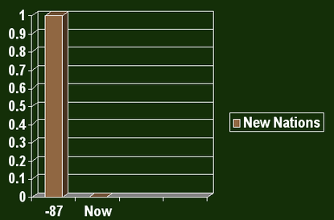

# Hi!

---

This is a sample presentation.

---

# Gettysburg Cemetery Dedication
Abraham Lincoln
11/19/1863

---

## Agenda
- Met on battlefield (great)
- Dedicate portion of field - fitting!
- Unfinished work (great tasks)

---

## Not on Agenda
1. Dedicate
2. Consecrate
3. Hallow (in narrow sense)
4. Add or detract
5. Note or remember what we say

---

## Review of key objectives and Critical Success factors
- What makes nation unique
	- Conceived in Liberty
	- Men are equal
	
- Shared vision
	- New birth of freedom
	- Gov't of/for/by the people
	
---

# Organizational Overview

---

# Summary

- New nation
- Civil war
- Dedicate field
- dedicated to unfinished work
- new birth of freedom
- Goverment not perish

---

With thanks to <http://norvig.com/Gettysburg/sld001.htm>
